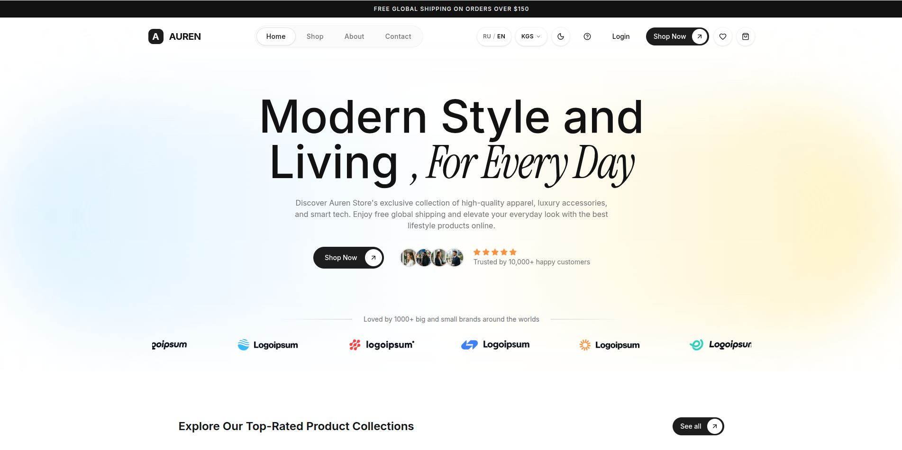
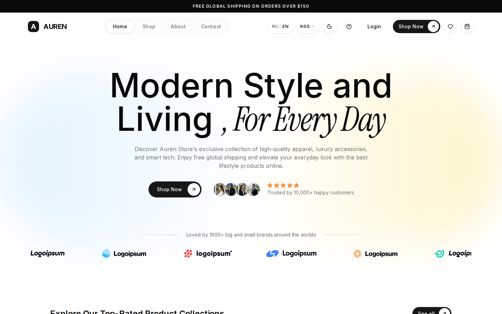
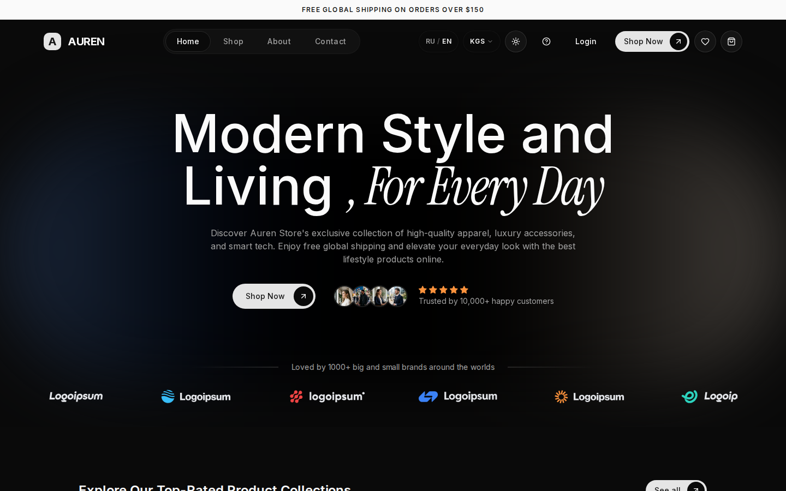
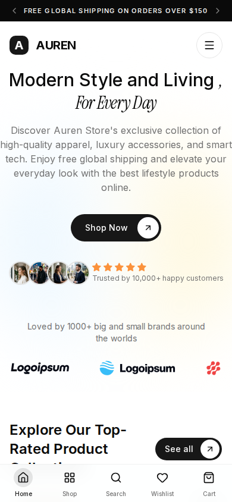

# Auren

<div align="center">
  
</div>

<div align="center">

[](https://nextjs.org)
[](https://www.typescriptlang.org)
[](https://tailwindcss.com)
[](#-лицензия)

</div>

**Auren** — минималистичный интернет-магазин моды и электроники: два языка, три валюты, светлая и тёмная тема из коробки. **[Открыть демо →](https://auren.example)**

## ✨ Возможности

- 🛍️ **Каталог товаров** — фильтры по категориям, страницы товаров с галереей, рейтингом и отзывами покупателей
- 🛒 **Корзина и избранное** — выезжающая панель корзины, wishlist, всё сохраняется в `localStorage`
- 💳 **Пошаговый чекаут** — информация → доставка → оплата, анимированный прогресс и подтверждение заказа
- 🌍 **Два языка RU / EN** — маршруты `/` и `/en/*` на next-intl, переключение без перезагрузки страницы
- 💱 **Три валюты KGS / USD / RUB** — конвертация всех цен на лету, курсы задаются в одном месте (`lib/currency.ts`)
- 🌓 **Светлая и тёмная тема** — next-themes без мигания при загрузке, светлая по умолчанию
- 📱 **Адаптивная вёрстка** — от 320px до десктопа; переключатели языка, валюты и темы аккуратно спрятаны в мобильное меню
- 🔍 **SEO из коробки** — уникальные `title`/`description` и OpenGraph для каждой страницы и локали, `robots.txt` и `sitemap.xml`

## 🛠️ Стек

| Технология | Зачем |
| --- | --- |
| [](https://nextjs.org) | App Router, SSG-маршруты, метаданные |
| [](https://react.dev) | Server и Client Components |
| [](https://www.typescriptlang.org) | Строгая типизация во всём проекте |
| [](https://tailwindcss.com) | Стилизация на утилитах и CSS-переменных тем |
| [](https://ui.shadcn.com) | Доступные компоненты: dropdown, sheet, accordion |
| [](https://next-intl.dev) | i18n RU/EN: словари, маршрутизация, плюрализация |
| [](https://github.com/pacocoursey/next-themes) | Переключение темы классом на `<html>` |

## 📁 Структура проекта

```
├── app/                  # Маршруты App Router
│   ├── [locale]/         # Локализованные страницы (ru — по умолчанию, en — /en/*)
│   ├── icon.svg          # Favicon: тёмный квадрат с буквой A
│   ├── robots.ts         # Генерация robots.txt
│   └── sitemap.ts        # Генерация sitemap.xml
├── assets/               # Логотип бренда
├── components/           # React-компоненты
│   ├── ui/               # Базовые компоненты shadcn/ui
│   ├── cart-context.tsx  # Состояние корзины (localStorage)
│   ├── currency-*        # Контекст и переключатель валют
│   ├── locale-switch.tsx # Переключатель RU/EN
│   ├── theme-*           # Провайдер и кнопка темы
│   └── shadcn-space/     # Секции страниц: hero, футер, карточки, чекаут
├── hooks/                # Общие React-хуки
├── i18n/                 # Конфигурация next-intl: routing, navigation, request
├── lib/                  # Каталог товаров, курсы валют, хелперы локализации
├── messages/             # Словари интерфейса: ru.json и en.json
├── proxy.ts              # Middleware next-intl (Next 16)
└── public/               # Статика: изображения товаров и секций
```

## 🚀 Быстрый старт

Требуется [Node.js 20+](https://nodejs.org) и [pnpm](https://pnpm.io).

1. Клонируйте репозиторий:

   ```bash
   git clone https://github.com/your-username/auren.git
   cd auren
   ```

2. Установите зависимости:

   ```bash
   pnpm install
   ```

3. Переменные окружения не требуются — шаблон работает из коробки. При необходимости создайте `.env.local`:

   ```bash
   # NEXT_PUBLIC_SITE_URL=https://your-domain.com
   ```

4. Запустите dev-сервер:

   ```bash
   pnpm dev
   ```

   Откройте [http://localhost:3000](http://localhost:3000) — русский интерфейс, английский доступен по `/en`.

Другие команды:

```bash
pnpm build       # production-сборка
pnpm start       # запуск собранного приложения
pnpm typecheck   # проверка типов
pnpm lint        # ESLint
```

## 📸 Скриншоты

<table>
  <tr>
    <td align="center"><strong>Светлая тема</strong></td>
    <td align="center"><strong>Тёмная тема</strong></td>
    <td align="center"><strong>Мобильная версия</strong></td>
  </tr>
  <tr>
    <td></td>
    <td></td>
    <td></td>
  </tr>
</table>

## 📄 Лицензия

Проект распространяется по лицензии [MIT](./LICENSE).
